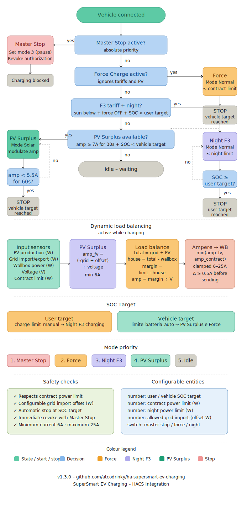

# SuperSmart EV Charging for Home Assistant

[](https://github.com/hacs/integration)
[](https://www.home-assistant.io/)

---

## Features

| Feature | Description |
|---|---|
| ☀️ **PV Surplus** | Dynamic current adjustment based on available solar surplus |
| 🌙 **Off-peak tariff** | Charge during cheap tariff periods (Italian F3, Tibber, Omie, etc.) |
| ⚡ **Load Balancing** | Automatic prevention of contract power overload |
| 🔋 **Dual SOC Target** | Separate SOC targets for daily use and solar/full charge |
| 🚀 **Force Charge** | Immediate override regardless of tariff or solar availability |
| 🛑 **Master Stop** | Single switch to block all charging globally |
| 📡 **Generic MQTT** | Fully configurable MQTT topics and payloads for any wallbox |
| 🔌 **Optional MQTT** | Works without a wallbox (monitoring only mode) |

---

## Compatibility

**Vehicles**: any EV with a Home Assistant integration exposing:
- a SOC sensor in percentage
- a binary sensor for cable connected status

Tested examples: Skoda Elroq, Volkswagen ID.4, Renault Zoe, Tesla (unofficial), BMW iX

**Wallboxes**: any wallbox controllable via MQTT:
- Silla Prism (default configuration)
- Easee (with MQTT bridge)
- go-e Charger
- Alfen Eve
- Any wallbox running OpenWB or similar firmware

**PV / meters**: any inverter or smart meter exposing power in Watts as a HA sensor  
(SolarEdge, Fronius, Huawei SUN2000, Shelly EM, Eastron SDM, etc.)

**Tariff sensors** (optional):
- [PUN Sensor](https://github.com/virtualdj/pun_sensor) for Italian F1/F2/F3 bands
- [Tibber](https://www.home-assistant.io/integrations/tibber/) for dynamic spot prices
- Any sensor returning a configurable string value

---

## Installation via HACS

1. In HACS → **Integrations** → ⋮ menu → **Custom repositories**
2. Add this repository URL, category **Integration**
3. Click **Install**
4. Restart Home Assistant
5. **Settings → Devices & Services → Add Integration** → search **SuperSmart EV Charging**

---

## Guided setup (3 steps)

### Step 1 – General settings
| Field | Description | Default |
|---|---|---|
| Contract power | Grid contract limit in Watts | 5700 W |
| Battery capacity | Vehicle battery pack in kWh | 60 kWh |
| Off-peak tariff | Enable night/cheap tariff charging | ✅ |
| MQTT | Enable wallbox control via MQTT | ✅ |

### Step 2 – Entity selection
Select existing HA entities for each role:

| Field | Required | Example |
|---|---|---|
| Vehicle SOC sensor | ✅ | `sensor.ev_battery_level` |
| Cable connected binary sensor | ✅ | `binary_sensor.ev_charger_connected` |
| Vehicle charge limit number | ⬜ | `number.ev_charge_limit` |
| Grid power sensor | ✅ | `sensor.grid_power` |
| PV production sensor | ✅ | `sensor.solar_power` |
| Wallbox power sensor | ⬜ | `sensor.wallbox_power` |
| Wallbox voltage sensor | ⬜ | `sensor.wallbox_voltage` |
| Tariff band sensor | ⬜ | `sensor.current_tariff` |
| Off-peak value | ⬜ | `F3` / `cheap` / `low` |

### Step 3 – MQTT configuration
| Field | Default (Silla Prism) |
|---|---|
| Authorize topic | `wallbox/command/authorize` |
| Revoke topic | `wallbox/command/revoke` |
| Set current topic | `wallbox/command/set_current_limit` |
| Set mode topic | `wallbox/command/set_mode` |
| Solar mode payload | `1` |
| Normal mode payload | `2` |
| Pause mode payload | `3` |

---

## Entities created by the integration

### 📊 Sensors
| Entity | Description |
|---|---|
| `sensor.charging_mode` | Current charging mode |
| `sensor.pv_surplus` | Available PV surplus (W) |
| `sensor.target_soc` | Active SOC target |
| `sensor.charging_time_remaining` | Estimated time remaining |
| `sensor.charge_end_time` | Estimated charge completion timestamp |
| `sensor.wallbox_current_target` | Theoretical target current from PV surplus (A) |

### 🔘 Switches
| Entity | Description |
|---|---|
| `switch.master_stop` | Block all charging globally |
| `switch.force_charge` | Force immediate charging |
| `switch.solar_controller_active` | Solar control active indicator |
| `switch.night_off_peak_charging` | Enable/disable off-peak charging |

### 🔢 Numbers (adjustable from UI or automations)
| Entity | Range | Default |
|---|---|---|
| `number.user_soc_target` | 10–100% | 50% |
| `number.vehicle_soc_target` | 20–100% | 80% |
| `number.contract_power_limit` | 1500–22000 W | 5700 W |
| `number.allowed_grid_import` | 0–3000 W | 200 W |
| `number.night_charging_power_limit` | 1000–22000 W | 3000 W |

### 🔽 Select
| Entity | Options |
|---|---|
| `select.charging_mode` | `idle`, `pv_surplus`, `night`, `force`, `master_stop` |

---

## Decision logic

```
Vehicle connected?
        │ NO → IDLE
        ▼ YES
Master Stop active? → YES → Revoke authorization → STOP
        │ NO
        ▼
Force Charge active? → YES → Charge to Vehicle SOC Target (load balanced)
        │ NO
        ▼
Off-peak tariff + Night Charging enabled? → YES → Charge to User SOC Target
        │ NO
        ▼
PV surplus ≥ min current (6A)? → YES → Solar charge to Vehicle SOC Target
        │ NO
        ▼
IDLE (waiting)
```

---

## Available services

```yaml
# Manually authorize charging
service: supersmart_ev_charging.authorize_charging

# Manually revoke authorization
service: supersmart_ev_charging.revoke_charging

# Set current limit manually
service: supersmart_ev_charging.set_charge_limit
data:
  current_a: 10   # value between 6 and 16
```

---

## Example Lovelace card

```yaml
type: entities
title: SuperSmart EV Charging
entities:
  - entity: select.charging_mode
  - entity: sensor.pv_surplus
  - entity: sensor.charging_time_remaining
  - entity: number.user_soc_target
  - entity: number.vehicle_soc_target
  - entity: switch.master_stop
  - entity: switch.force_charge
  - entity: switch.night_off_peak_charging
  - entity: number.allowed_grid_import
  - entity: number.contract_power_limit
```

---

## Complete automation flow



> A generic HACS integration for smart EV charging.  
> Compatible with any electric vehicle, any MQTT-capable wallbox, and any solar PV system.

---

## File structure

```
custom_components/supersmart_ev_charging/
├── __init__.py          # Integration setup and HA services
├── coordinator.py       # Smart charging logic + MQTT commands
├── config_flow.py       # 3-step guided configuration UI
├── const.py             # Constants and default values
├── sensor.py            # Derived sensors
├── switch.py            # Switches (Master Stop, Force, Solar, Night)
├── number.py            # Adjustable parameters
├── select.py            # Charging mode selector
├── manifest.json        # HACS integration metadata
├── strings.json         # Italian UI strings
└── translations/
    ├── it.json          # Italian translation
    └── en.json          # English translation
```

---

## Credits

Based on the automation logic from the original project  
[ha-skoda-elroq-smart-charging](https://github.com/atcodrinky/ha-skoda-elroq-smart-charging) by [@atcodrinky](https://github.com/atcodrinky).

---

## License

MIT License – see [LICENSE](LICENSE) file
